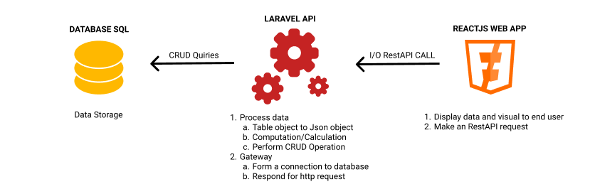

# SOFTWARE ARCHITECTURE
This is a top overview documentation about the hrmis software architecture and design principles. Information written in here are under subject for change in case for future modification.
## TASK OVERVIEW

## FRONT-END REACT JS
React dont use any software design pattern principles available (mvc, mvvm etc.). It introduce a component based architecture and follows the one page web application development.
- **FOLDER HEIRARCHY**
	- **build Folder**: Here resides the compiled version (Binary version) of the software.
	- **public Folder**: Use for running the program locally upon development no server required
	-  **src Folder**: Here resides the source code
		- **assets**: Folder for images, fonts, etc.
		- **css** : Folder for global default styles.
		- **components**: Folder for global components such as input, search, dropdown, navbar etc.
		- **modules**: Folder for page components such as plantilla, library. dashboard etc. 
		- **App.js**: Every main components resides here to form the layout of a single page web application. 
		- **index.js**: Here we call the App.js for display.
	- **package.json**: Configuration file for react (app configs, dependencies, framework etc.)
- **VARIABLE, FUNCTION, AND CLASSES**	
	- **Functions**: Function can be used as a components or methods,
		- Function as components follows pascalcase naming convention
		- Function as method uses camelcase naming convention
	- **Classes**: Most of the time function will be greatly use due hooks ( React new feature ) are not applicable in classes which this hooks has big advantage in state managemet. Classes uses pascalcase naming convention
	- **Variables**: should always use camelcase naming convention for code readability recommended for javascript programming.
## BACK-END LARAVEL
- **TBA**
